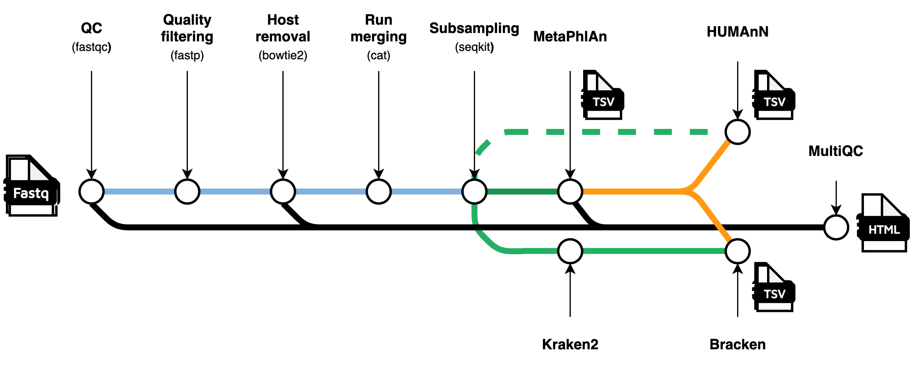

# Metagenomics pipeline to get taxonomy and pathways

 This pipeline can be used to obtain tax profiles, pathway abundance tables from metagenomic reads. The input The MetaPhlAn, HUMAnN and Kraken2 databases are in the current version downloaded as part of the pipeline and stored in the db folder (the first time you use the pipeline, it therefore takes a bit longer).

[](https://www.nextflow.io/)
[](https://docs.conda.io/en/latest/)
[](https://www.docker.com/)
[](https://sylabs.io/docs/)

## Introduction

**metagenomicspipeline** is a bioinformatics pipeline that processes shotgun metagenomics reads to obtain relative abundances and pathway abundances using BioBakery software.



1. Input check
2. Preprocessing
   - Read QC ([`FastQC`](https://www.bioinformatics.babraham.ac.uk/projects/fastqc/))
   - Quality filtering and adapter trimming with [`fastp`](https://github.com/OpenGene/fastp)
   - Human read filtering: [`Bowtie2`](https://bowtie-bio.sourceforge.net/bowtie2/index.shtml) to build an index and align reads with the human reference genome to filter out human reads and [`Samtools`](http://www.htslib.org/) stats for read stats
   - Subsampling reads using [`seqkit`](https://bioinf.shenwei.me/seqkit/)
3. Taxonomy profiles: [`MetaPhlAn`](https://github.com/biobakery/MetaPhlAn/wiki/MetaPhlAn-4) (default) or [`Kraken2`](https://github.com/DerrickWood/kraken2)
4. Pathway abundances: [`HUMAnN`](https://github.com/biobakery/humann)
5. Present a MultiQC report ([`MultiQC`](http://multiqc.info/))

If you only want to use certain parts of the pipeline, you can use the flags `--skip-processing`, `--skip-metaphlan`, `--skip-humann` to skip certain subworkflows. If you want to get Kraken2 profiles instead of MetaPhlAn, use `--skip-kraken false`.

## Usage

:::note
If you are new to Nextflow and nf-core, please refer to [this page](https://nf-co.re/docs/usage/installation) on how
to set-up Nextflow. Make sure to [test your setup](https://nf-co.re/docs/usage/introduction#how-to-run-a-pipeline)
with `-profile test` before running the workflow on actual data.
:::

First, prepare a samplesheet with your input data that looks as follows:

`samplesheet.csv`:

```csv
sample,fastq_1,fastq_2
CONTROL_REP1,AEG588A1_S1_L002_R1_001.fastq.gz,AEG588A1_S1_L002_R2_001.fastq.gz
```

Each row represents a pair of fastq files. This pipeline does accept single-end and paired-end fastq files. For single-end data, use only `fastq_1`. 

Now, you can run the pipeline using:

```bash
nextflow run barbarahelena/metagenomicspipeline \
   -profile <docker/singularity/.../institute> \
   --input samplesheet.csv \
   --genome GRCh38 \
   --outdir <OUTDIR>
```

The subsampling level is by default is 20 million. If you want to change this subsampling level, you can specify it by using `--subsamplelevel 10000000` (to set it to 10 million, for example).

I recommend using `docker` or `singularity`, this is a lot less error prone because of the containerized environments. If you don't have container software installed, you can also use `conda` as profile. For users at the University of Amsterdam: use the profile `snellius` if you are using the Snellius (uses Singularity by default).

You can also run a test that uses the `samplesheet_test.csv` in the assets folder (you don't need data for this), using:

```bash
nextflow run barbarahelena/metagenomicspipeline \
   -profile test \
   --outdir <OUTDIR>
```

### HPC
If you are working on an HPC, there might be specific rules on how many jobs the pipeline can submit in a specific timeframe. I wrote a separate instruction for use on HPCs in the [usage documentation](https://github.com/barbarahelena/metagenomicspipeline/blob/master/docs/output.md)

For more details and further functionality, please refer to the [usage documentation](https://github.com/barbarahelena/metagenomicspipeline/blob/master/docs/output.md) and the [parameter documentation](https://github.com/barbarahelena/metagenomicspipeline/blob/master/docs/parameters.md).

## Pipeline output

All output of the different parts of the pipeline are stored in subdirectories of the output directory. These directories are named after the tools that were used ('metaphlan', 'humann', etc.). Other important outputs are the multiqc report in the multiqc folder and the execution html report in the pipeline_info folder.

For more details on the pipeline output, please refer to the [output documentation](https://github.com/barbarahelena/metagenomicspipeline/blob/master/docs/output.md).

## Credits

I used the nf-core template as much as possible and used the [taxprofiler](https://github.com/nf-core/taxprofiler/tree/1.1.3) nf-core pipeline and [Eduard's metagenomics pipeline](https://github.com/EvdVossen/Metagenomic_pipeline/tree/main) as examples.

## Contributions and Support

If you would like to contribute to this pipeline, please see the [contributing guidelines](.github/CONTRIBUTING.md).
For further information or help, don't hesitate to get in touch.

## Citations

This pipeline uses bioBakery software, including MetaPhlAn and HUMAnN. It also uses Kraken2, if you specify it in the options (`--skip_metaphlan`, with `--skip_kraken false`). Please cite the papers of these tools. An extensive list of references for the tools used by the pipeline can be found in the [`CITATIONS.md`](CITATIONS.md) file.

If you use  this metagenomicspipeline for your analysis, please cite it using the following doi: [10.5281/zenodo.10663326](https://doi.org/10.5281/zenodo.10663326).